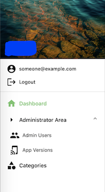

# ActiveMaterialIcon

ActiveMaterialIcon is an additional menu icon for [active_material](https://github.com/vigetlabs/active_material). It is specified for branch `nh-responsive-redesign`.

By installing ActiveMaterialIcon you will have a material icons on your menu.



## Installation

Add this line to your application's Gemfile:

```ruby
gem 'active_admin'
gem 'active_material', github: 'vigetlabs/active_material', branch: 'nh-responsive-redesign'
gem 'active_material_icon' # ActiveMaterialIcon after active_admin and active_material
```

Please make sure that ActiveMaterialIcon is placed after active_admin and active_material.

And then execute:

    $ bundle

Or install it yourself as:

    $ gem install active_material_icon


Before installing ActiveMaterialIcon, in order to make this gem working, you have to :

1. Generate active_admin `rails g active_admin:install`
2. Use [active_material](https://github.com/vigetlabs/active_material#usage) responsive branch `gem 'active_material', github: 'vigetlabs/active_material', branch: 'nh-responsive-redesign'`
3. Follow [usage](https://github.com/vigetlabs/active_material#usage) of active_material, especially on SCSS `@import "active_material";`

Generate installation of ActiveMaterialIcon:

    $ rails g active_material_icon:install

## Changes

Some files are changed automatically when you run install generator :

1. File `config/initializers/active_admin.rb` before line *# == Menu System*
2. File `app/assets/stylesheets/active_admin.scss` after line *@import "active_material";*

## Usage

ActiveMaterialIcon comes with new argument `icon` in menu builder. You could add any material icons on your menu.

List of [material icons](https://material.io/tools/icons/?style=baseline).

Example :

```ruby
menu priority: 1, label: proc { I18n.t("active_admin.dashboard") }, icon: :home
```

## Development

After checking out the repo, run `bin/setup` to install dependencies. Then, run `rake spec` to run the tests. You can also run `bin/console` for an interactive prompt that will allow you to experiment.

To install this gem onto your local machine, run `bundle exec rake install`.

## Release

To release a new version, update the version number in `version.rb`, and then run `bundle exec rake release`, which will create a git tag for the version, push git commits and tags, and push the `.gem` file to [rubygems.org](https://rubygems.org).

You could use [gem release](https://github.com/svenfuchs/gem-release). 
1. Install gem release using command `gem install gem-release`. 
2. Update version using command `gem bump minor`
3. Build gem using command `gem build active_material_icon.gemspec`
4. Release gem using command `gem release`

## Contributing

Bug reports and pull requests are welcome on GitHub at https://github.com/yunanhelmy/active_material_icon. This project is intended to be a safe, welcoming space for collaboration, and contributors are expected to adhere to the [Contributor Covenant](http://contributor-covenant.org) code of conduct.

## License

The gem is available as open source under the terms of the [MIT License](https://opensource.org/licenses/MIT).

## Code of Conduct

Everyone interacting in the ActiveMaterialIcon project’s codebases, issue trackers, chat rooms and mailing lists is expected to follow the [code of conduct](https://github.com/yunanhelmy/active_material_icon/blob/master/CODE_OF_CONDUCT.md).
